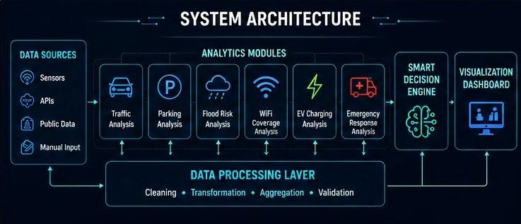
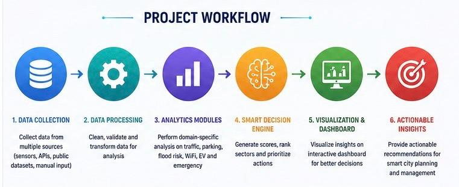
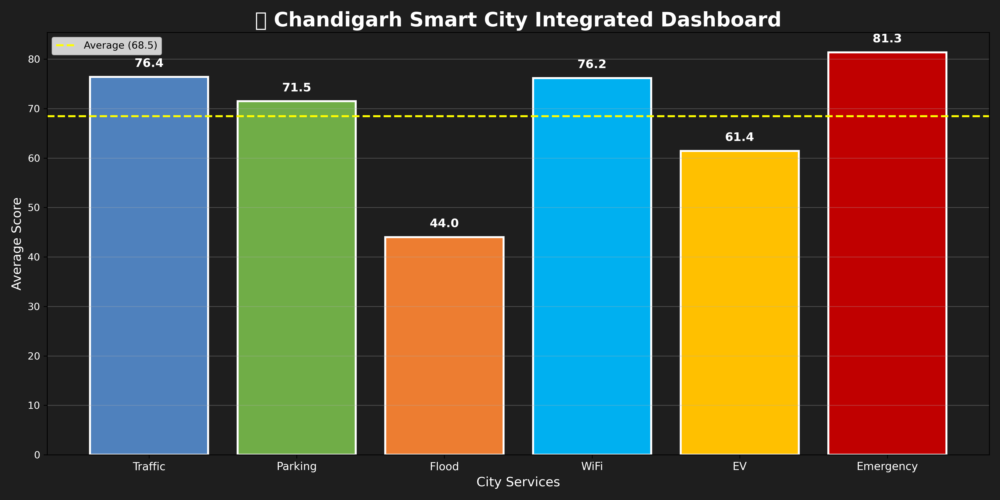
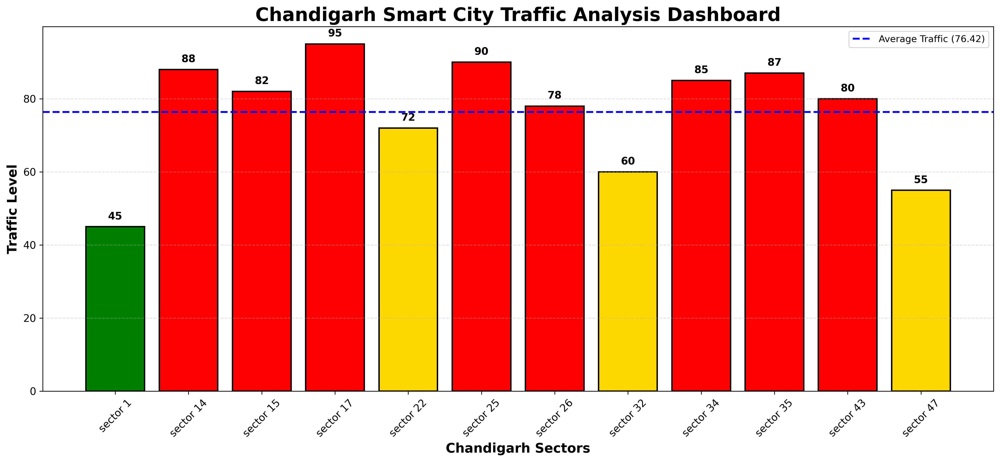
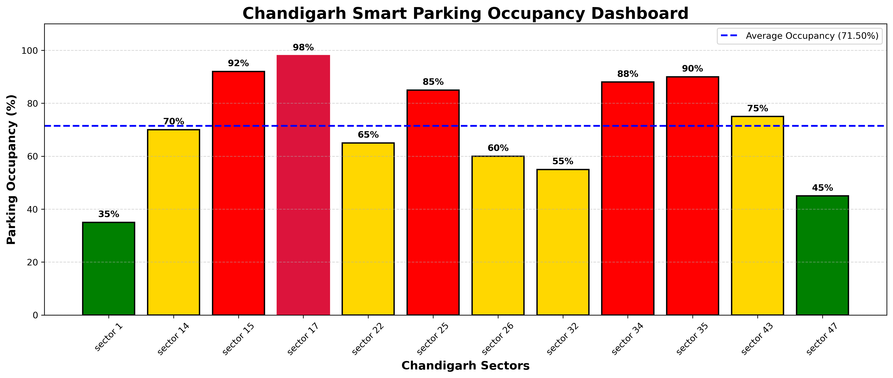
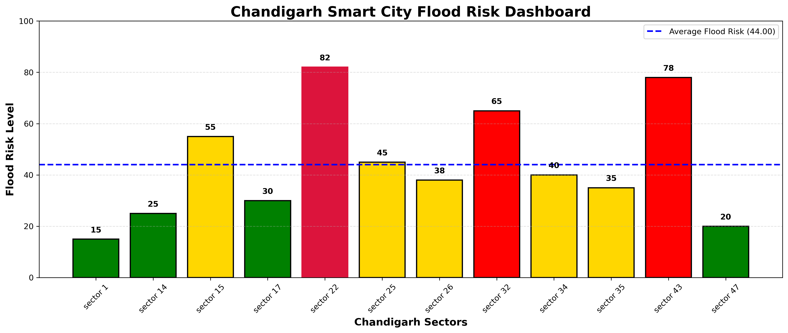
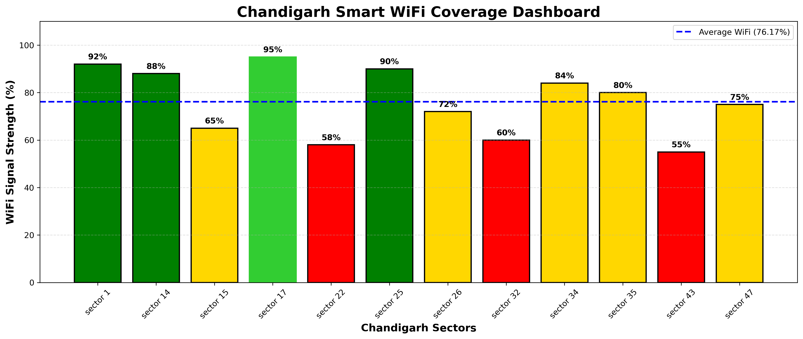
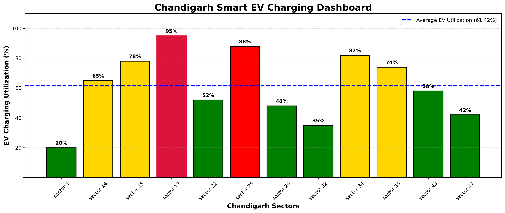
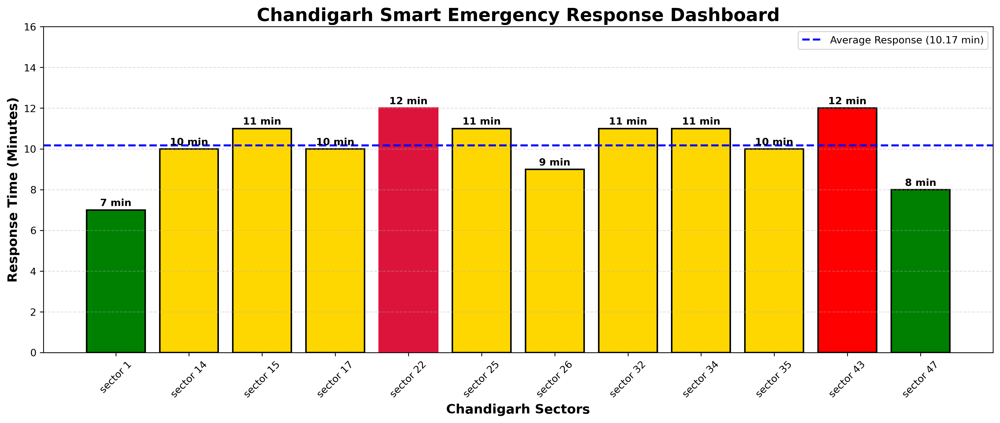
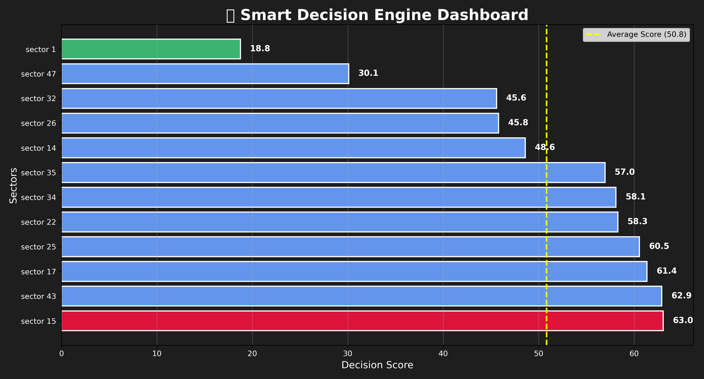

# 🏙 Chandigarh Smart City Digital Twin


### Intelligent Urban Analytics using Python & NumPy

A data-driven Smart City simulation that analyzes traffic, parking, flood risk, WiFi coverage, EV charging demand, emergency response, and city-wide decision making using Python and NumPy.


## 📸 Project Preview

## 📖 Project Overview

The **Chandigarh Smart City Digital Twin** is an intelligent urban analytics platform developed using **Python**, **NumPy**, and **Matplotlib**. It simulates multiple smart city services such as traffic management, parking optimization, flood monitoring, WiFi coverage, EV charging infrastructure, emergency response, and an integrated decision engine.

The project demonstrates how numerical computing and data analytics can be used to solve real-world urban challenges through simulation, visualization, and intelligent recommendations.

# ✨ Features
- 🚗 Traffic Analytics
- 🅿 Smart Parking Optimization
- 🌧 Flood Risk Assessment
- 📡 WiFi Coverage Analysis
- ⚡ EV Charging Analytics
- 🚑 Emergency Response System
- 🧠 Smart Decision Engine
- 🏙 Integrated Smart City Dashboard
- 📊 Professional Data Visualizations
- 📈 City Health Score

## 🛠 Technologies Used

| Technology | Badge | Purpose |
|------------|-------|---------|
| Python |  | Core programming language used to build the Smart City Digital Twin. |
| NumPy |  | Performs numerical computing, matrix operations, and data analysis. |
| Matplotlib |  | Generates professional charts, graphs, and dashboard visualizations. |
| Jupyter Notebook |  | Interactive environment used for development, analysis, and documentation. |


## 🏗 Project Architecture

The Smart City Digital Twin integrates multiple urban analytics modules to monitor city operations, generate insights, and support intelligent decision-making.

<h2 align="center">🏗 Project Architecture</h2>

<p align="center">
  
</p>

```Text
                        Chandigarh Smart City

                               │
        ┌──────────────────────┼──────────────────────┐
        │                      │                      │
        ▼                      ▼                      ▼
   🚗 Traffic             🅿 Parking           🌧 Flood Risk
        │                      │                      │
        └──────────────┬───────┴──────────────┬───────┘
                       ▼                      ▼
                📡 WiFi Coverage      ⚡ EV Charging
                       │                      │
                       └──────────────┬───────┘
                                      ▼
                          🚑 Emergency Response
                                      │
                                      ▼
                         🧠 Smart Decision Engine
                                      │
                                      ▼
                   📊 Integrated Smart City Dashboard
                                      │
                                      ▼
                    💡 Smart Recommendations & Insights
```

## 🔄 Project Workflow
The project follows a complete analytics workflow from data collection to visualization and smart recommendations.

<h2 align="center">🏗 Project Architecture</h2>

<p align="center">
  
</p>

```text
Input Data
    │
    ▼
NumPy Arrays
    │
    ▼
Data Analysis
    │
    ▼
Visualization
    │
    ▼
Decision Engine
    │
    ▼
Recommendations
    │
    ▼
Integrated Smart City Dashboard
```
## 📂 Project Structure

```text
Chandigarh-Smart-City-Digital-Twin
│
├── README.md
├── requirements.txt
├── LICENSE
│
├── notebooks
│   └── SmartCity_Twin.ipynb
│
├── screenshots
│   ├── dashboard.png
│   ├── traffic.png
│   ├── parking.png
│   ├── flood.png
│   ├── wifi.png
│   ├── ev.png
│   └── emergency.png
│
└── assets
    └── architecture.png
```


## 📸 Dashboard Screenshots

### 🏙 Integrated Smart City Dashboard



---

### 🚗 Traffic Analysis



---

### 🅿 Parking Analysis



---

### 🌧 Flood Risk Analysis



---

### 📡 WiFi Coverage Analysis



---

### ⚡ EV Charging Analysis



---

### 🚑 Emergency Response Analysis



---

### 🧠 Smart Decision Engine




## ⚙ Installation

Clone the repository

```bash
git clone https://github.com/Shubhh23/Chandigarh-SmartCity-Digital-Twin.git
```

Navigate to the project

```bash
cd Chandigarh-SmartCity-Digital-Twin
```

Install dependencies

```bash
pip install -r requirements.txt
```


## ▶ Run the Project

Launch Jupyter Notebook

```bash
jupyter notebook
```

Open

```text
SmartCity_Twin.ipynb
```

Run all cells to generate the complete Smart City Dashboard and analytics.


## 🚀 Future Scope

Future versions of this project can include:

- 🤖 AI-based Traffic Prediction
- 🌦 Live Weather API Integration
- 🗺 Google Maps / OpenStreetMap Integration
- 📡 IoT Sensor Integration
- 🚁 Drone-based Smart City Monitoring
- 📹 CCTV-based Vehicle Detection
- 📊 Power BI Interactive Dashboard
- 🧠 Machine Learning Models
- 📱 Mobile Application
- ☁ Cloud-based Deployment
---

# 🌆 Project Identity

<p align="center">

</p>

## 👨‍💻 Author

**Shubh Chak**

IT Student | UIET, Panjab University

Aspiring Data Analyst | Python | NumPy | SQL | Power BI

⭐ If you found this project useful, consider giving it a star!

